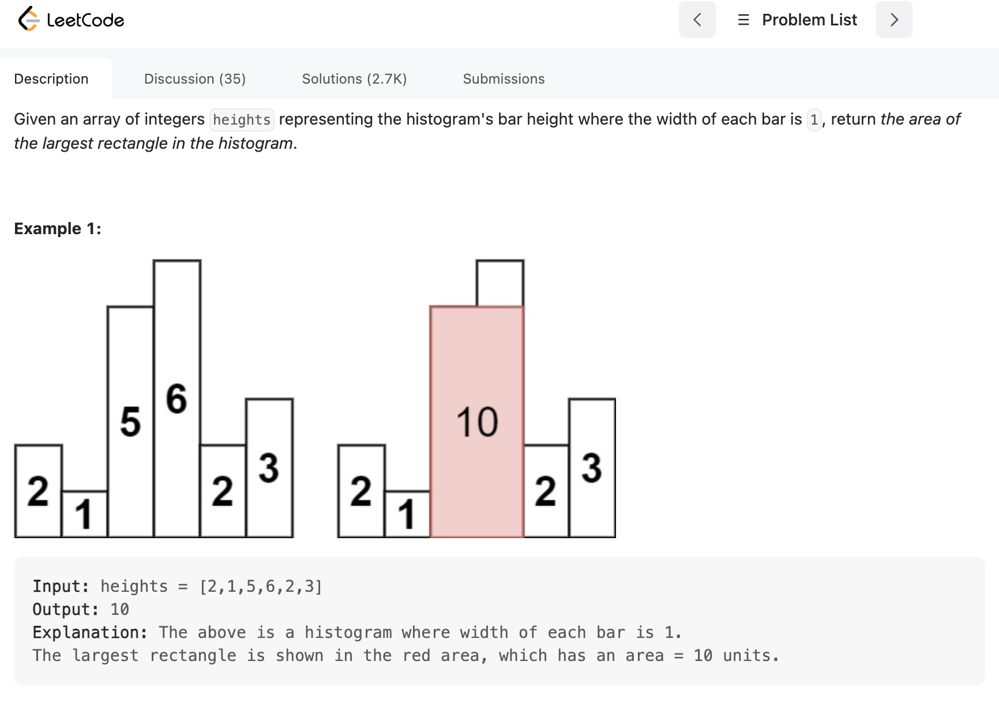

### 题目描述如下


>  **单调栈（可以获得前一个比这个大或者小的值的下标）**：遍历每个数**左右**两边比这个数小的下标位置。因为只有当这个数最小的时候，扩张左右使得j-i+1变大，否则遇到新的更小的数，就要比较哪个`最小值*长度`更大，找到以每个数为顶的最大矩阵面积。

[题目链接](https://leetcode.com/problems/largest-rectangle-in-histogram/description/)
```
class Solution {
public:
    int largestRectangleArea(vector<int>& heights) {
        stack<int> st;
        int n = heights.size();
        vector<int> right(n,n); //找到右边比当前小的第一个数下表
        vector<int> left(n,-1); //找到右边比当前小的第一个数下表
        int max_aera = 0;
        for(int i=0; i < heights.size(); i++){
            while(!st.empty() && heights[i] < heights[st.top()]){
                right[st.top()] = i;
                st.pop();
            }
            left[i] = st.empty()?-1:st.top();
            st.push(i);
        }

        // 1 -1 4 4 -1 -1 
        // -1 -1 1 2 1 4 
        for (int i = 0; i < n; i++){ //遍历全部

            int len = right[i]-left[i]-1;
            max_aera = max(max_aera, heights[i]*len);
          
        }
        return max_aera;
    }
};


```

