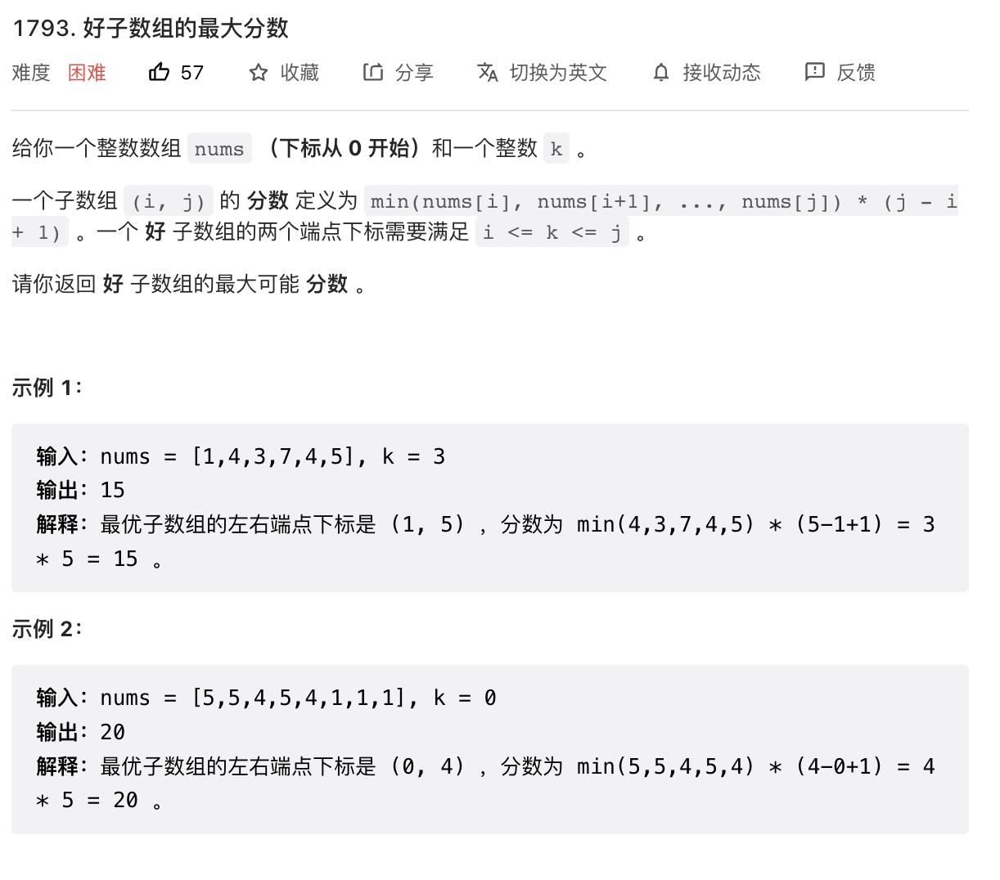

### 题目描述如下


> 第一种解法 双指针 + **单调栈（可以获得前一个比这个大或者小的值的下标）**：遍历每个数**左右**两边比这个数小的下标位置。因为只有当这个数最小的时候，扩张左右使得j-i+1变大，否则遇到新的更小的数，就要比较哪个`最小值*长度`更大。

```
class Solution {
public:
    int maximumScore(vector<int>& nums, int k) {
       int ret = 0;
       stack<int> st;
       int n = nums.size();
       vector<int> left(n), right(n,n);

       for(int i=0; i < n;i++){
           while(!st.empty() && nums[i]<nums[st.top()])// 先存入的比当前的数大  
           {
               // top是左边，i是右边，左边比右边大，意味着右边比左边小
               right[st.top()] = i;//更新右边比当前值小的数
                st.pop();
           }
           left[i] = st.empty()?-1:st.top();//把左边比自己高的全删了，那剩下第一个肯定比自己小, 就算下一个来说，前一个肯定比删掉的要小
           st.push(i);
       }
       for(auto i:left){
           std::cout << i << " ";
       }
       std::cout << std::endl;
 for(auto i:right){
           std::cout << i << " ";
       }
         for(int i=0;i<n;i++){
        if(left[i]+1<=k&&right[i]-1>=k){
            ret = max(ret, (right[i]-left[i]-1)*nums[i]);
        }
    }
    return ret;
    } 
};


```

> 第二种解法 双指针：直接从k开始左右扩张，左右都要找到比nums[k]小的下标位置（扩不动了），更新minValue（左右更大的那个值，要一点点下降minValue）,再左右继续扩张，一直l=0，r=nums.size(), 相当于每个**每个长度区间**都都遍历了一遍，并且保证minValue 是每个区间的最小值。

```
class Solution {
public:
    int maximumScore(vector<int>& nums, int k) 
    {
        int n = nums.size();
        int l = k, r = k;
        int minVal = nums[k];
        int ret = 0;
        while (l>=0 || r < n)
        {
            while (l>=0 && nums[l]>=minVal) l--;
            while (r<n && nums[r]>=minVal) r++;
            ret = max(ret, (r-l-1)*minVal);            
            minVal = max(l>=0?nums[l]:INT_MIN, r<n?nums[r]:INT_MIN);
        }
        return ret;
    }
};
```